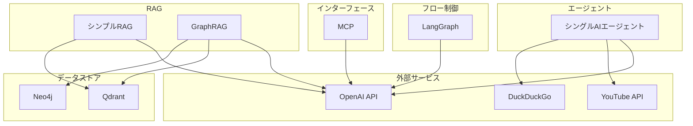

# AIエージェントと言語モデル学習リポジトリ

## 概要

このリポジトリは、AIエージェントと大規模言語モデル（LLM）を活用したさまざまな実装例を集めた学習用リポジトリです。RAG（Retrieval Augmented Generation）、LangGraph、グラフデータベースを用いた知識ベースシステム、MCPなど多様なAI技術の実装例を提供しています。

## 実装された機能

このリポジトリには以下の主要な実装が含まれています：

### シングルAIエージェント（ai_agent/single_agent）
- Web検索とYouTube検索機能を備えたシンプルなAIエージェント
- LangChainとOpenAI APIを使用
- DuckDuckGo検索とYouTube API検索の統合

### RAG実装（rag）
- Qdrantベクトルデータベースを使用したRetrieval Augmented Generation
- OpenAIのエンベディングモデルによるテキスト検索
- 通常のLLMとRAGの比較デモ
- CLIインターフェースとPythonライブラリとしての実装

### GraphRAG実装（graph_rag）
- Neo4jグラフデータベースとQdrantベクトルデータベースを組み合わせた高度なRAG
- エンティティと関係を抽出し、知識グラフを構築
- 構造化データと非構造化データのハイブリッド検索
- 関連エンティティを通じたコンテキスト拡張

### LangGraph実装（lang_graph）
- 3種類のグラフ実装（シンプルグラフ、決定グラフ、チャットグラフ）
- 状態管理と複雑なワークフローの制御
- ツール使用と条件分岐のモデリング
- 会話処理のためのチャットグラフ

### MCP実装（mcp/golang）
- Model Control Protocol（MCP）のGolangによる実装
- AIモデルとツール間のインターフェース標準化
- シンプルな電卓サービスの例

## アーキテクチャ



## 技術スタック

- **Python 3.13+**: メインの開発言語
- **LangChain**: AIエージェント構築フレームワーク
- **LangGraph**: 状態管理と複雑なワークフロー実装
- **OpenAI API**: LLMとエンベディングモデル
- **Qdrant**: ベクトルデータベース
- **Neo4j**: グラフデータベース
- **Docker**: 開発環境の構築
- **Golang**: MCPサーバーの実装

## セットアップと実行

### 環境構築

```bash
uv venv
uv pip install -e .
```

### 依存関係管理

```bash
# 依存関係の追加
uv pip install <パッケージ名>

# 開発用依存関係の追加
uv pip install -D <パッケージ名>
```

### 実行例

#### メインアプリケーション

```bash
uv run main.py
```

#### RAGデモ

```bash
python -m rag.demo
```

#### GraphRAGの使用

```bash
# データのロード
python -m graph_rag.cli load --file data/hololive/sakura-miko.txt --entity-type VTuber --entity-id sakura-miko

# 質問の処理
python -m graph_rag.cli ask --question "さくらみこの初のソロライブについて教えてください" --entity-id sakura-miko --entity-type VTuber
```

## Dockerによる開発環境

データベース（Neo4j、Qdrant）はDockerで提供されています：

```bash
docker compose up -d
```

## API キーの設定

`.env`ファイルを作成し、必要なAPIキーを設定します：

```
OPENAI_API_KEY=your_openai_api_key
YOUTUBE_API_KEY=your_youtube_api_key
```

## ほぼAIで実装

このリポジトリのコードは、主にClaude Codeを使用して実装されています。