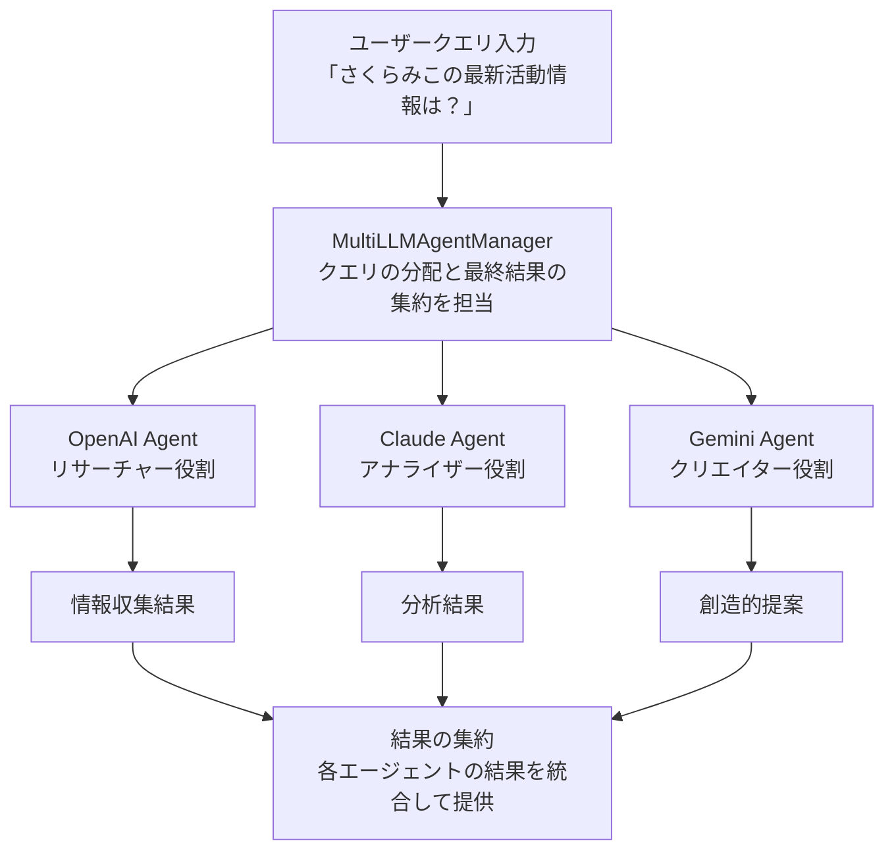
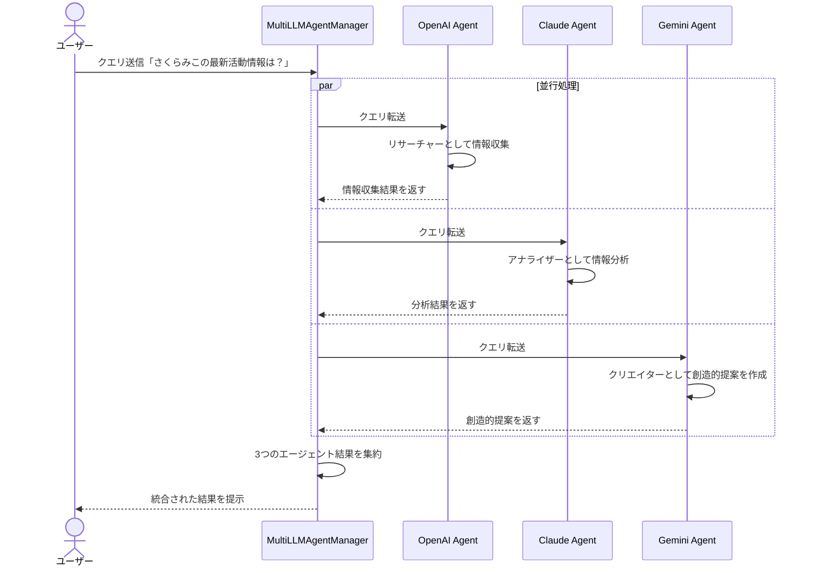

# マルチLLMエージェント

このディレクトリには、複数のLLM（OpenAI、Claude、Gemini）を使用したマルチエージェントの実装が含まれています。

## 概要

マルチLLMエージェントは以下のコンポーネントで構成されています：

- `agent_manager.py`: 複数のLLMエージェントを管理し、タスクの分配と結果の集約を行います
- `openai_agent.py`: OpenAIのモデルを使用したエージェントの実装
- `claude_agent.py`: Anthropicのモデルを使用したエージェントの実装
- `gemini_agent.py`: GoogleのGeminiモデルを使用したエージェントの実装

## アーキテクチャと処理フロー

マルチLLMエージェントシステムは以下のような役割分担とフローで動作します：



### シーケンス図



### 各LLMの役割分担

1. **OpenAI Agent (リサーチャー)** - 情報収集役
   - 使用モデル: `gpt-4o-mini`
   - 主な役割: さくらみこに関する事実情報の収集
   - ツール: Web検索、YouTube検索
   - 特徴: 正確な情報収集と最新情報の取得に特化

2. **Claude Agent (アナライザー)** - 情報分析役
   - 使用モデル: `claude-3-haiku-20240307`
   - 主な役割: 収集された情報の分析と評価
   - ツール: Web検索、YouTube検索
   - 特徴: 情報の信頼性評価、多角的な視点での分析

3. **Gemini Agent (クリエイター)** - 創造的提案役
   - 使用モデル: `gemini-pro`
   - 主な役割: 創造的なコンテンツやアイデアの提案
   - ツール: Web検索、YouTube検索
   - 特徴: 収集情報に基づく独創的な提案や表現

### 処理フロー

1. ユーザーが「さくらみこの最新活動情報は？」と質問
2. `MultiLLMAgentManager`が各エージェントにクエリを分配
3. 各エージェントが並行して処理を実行:
   - OpenAIエージェント: 最新の活動情報を検索・収集
   - Claudeエージェント: 収集情報の分析と重要度評価
   - Geminiエージェント: 活動情報に基づく創造的視点の提供
4. 各エージェントの結果を`MultiLLMAgentManager`が集約
5. 統合された結果をユーザーに提示

## 使用方法

```python
from ai_agent.multi_llm_agent.agent_manager import MultiLLMAgentManager
import datetime

# 現在時刻の取得
current_time = datetime.datetime.now().strftime("%Y年%m月%d日 %H:%M:%S")

# マルチエージェントマネージャーの初期化
manager = MultiLLMAgentManager()

# クエリの実行
result = manager.run(f"現在時刻は{current_time}です。さくらみこの最新活動情報は？")
print(result["aggregated"])
```

## 設定

以下の環境変数を設定する必要があります：

- `OPENAI_API_KEY`: OpenAIのAPIキー
- `ANTHROPIC_API_KEY`: AnthropicのAPIキー
- `GOOGLE_API_KEY`: GoogleのAPIキー（Gemini用）
- `YOUTUBE_API_KEY`: YouTube検索用のAPIキー
