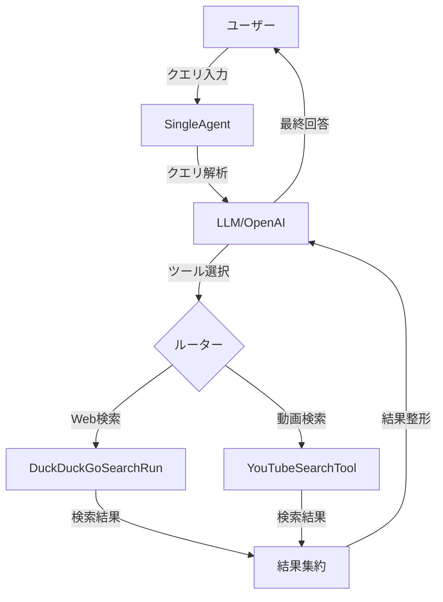
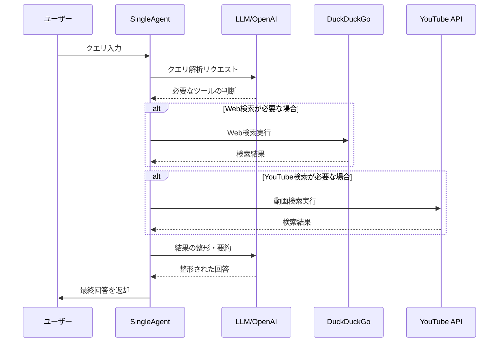

# シングルエージェント

このディレクトリには、ウェブ検索とYouTube検索を実行できるシンプルなAIエージェントの実装が含まれています。

## 機能

- DuckDuckGoを使用したウェブ検索
- YouTube Data APIを使用したYouTube動画検索
- エージェントフレームワークとしてLangChainと統合

## 使用方法

```python
from ai_agent.single_agent import SingleAgent

# エージェントの初期化
agent = SingleAgent()

# クエリの実行
result = agent.run("AIの最新の進展は何ですか？")
print(result["output"])
```

## 環境変数

- `YOUTUBE_API_KEY`: YouTube検索機能に必要
  - [Google Cloud Console](https://console.cloud.google.com/)から取得
  - プロジェクトでYouTube Data API v3を有効にする必要があります

## 依存関係

- langchain
- langchain-openai
- requests

## 使用例

### ウェブ検索

```python
agent = SingleAgent()
result = agent.run("フランスの首都は何ですか？")
print(result["output"])
```

### YouTube検索

```python
agent = SingleAgent()
result = agent.run("Pythonプログラミングに関する動画を探して")
print(result["output"])
```

## アーキテクチャ



## 処理フロー



## コンポーネント説明

### SingleAgent

- ユーザーからのクエリを受け付け
- LLMを使用してクエリを解析
- 適切なツールを選択して実行
- 結果を整形して返却

### 検索ツール

1. **DuckDuckGoSearchRun**
   - Webページの検索実行
   - テキストベースの情報収集
   - APIキー不要

2. **YouTubeSearchTool**
   - YouTube動画の検索実行
   - 動画情報の取得
   - YouTube Data API v3のキーが必要

### LLM（Language Model）

- クエリの意図理解
- 適切なツールの選択
- 検索結果の整形・要約
- 自然言語での回答生成
